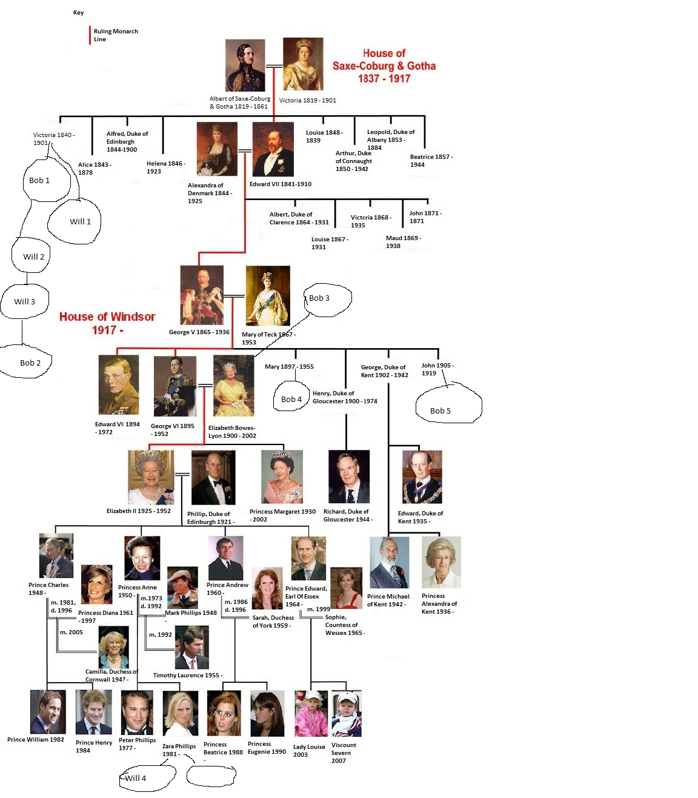

# Genealogical Tree
Provides basic ADT for storing genealogical tree in some location.

## gtree::Person
Basic interface for persons in genealogical tree.

Each one posses 4 string properties: `firstName`, `lastName`, `location` and
`dateOfBirth`.

Also there are methods to query each person's `parents`, `children` and
`descendants`.

To get all descendants for given person one should use for-range loop:
    for (const auto d : person->descendants()) {
        std::cout << *d << '\n';
    }

*NOTE* Person cannot be constructed outside `gtree::Tree`.

Person's parents can be set via `setPerson` and `setPersonUnsafe` (without
checks for loops in tree).
## gtree::Tree
Main interface to whole tree.

Posses following methods
* `createPerson`
* `searchBy*` query methods.
* `root` returns special «root» person, that is default parent for all new
  persons.

# bobfinder
Sample program that creates sample tree with couple of Bobs and Wills in it.
Then it searches for all Wills who are descendant to some Bob and prints them.

